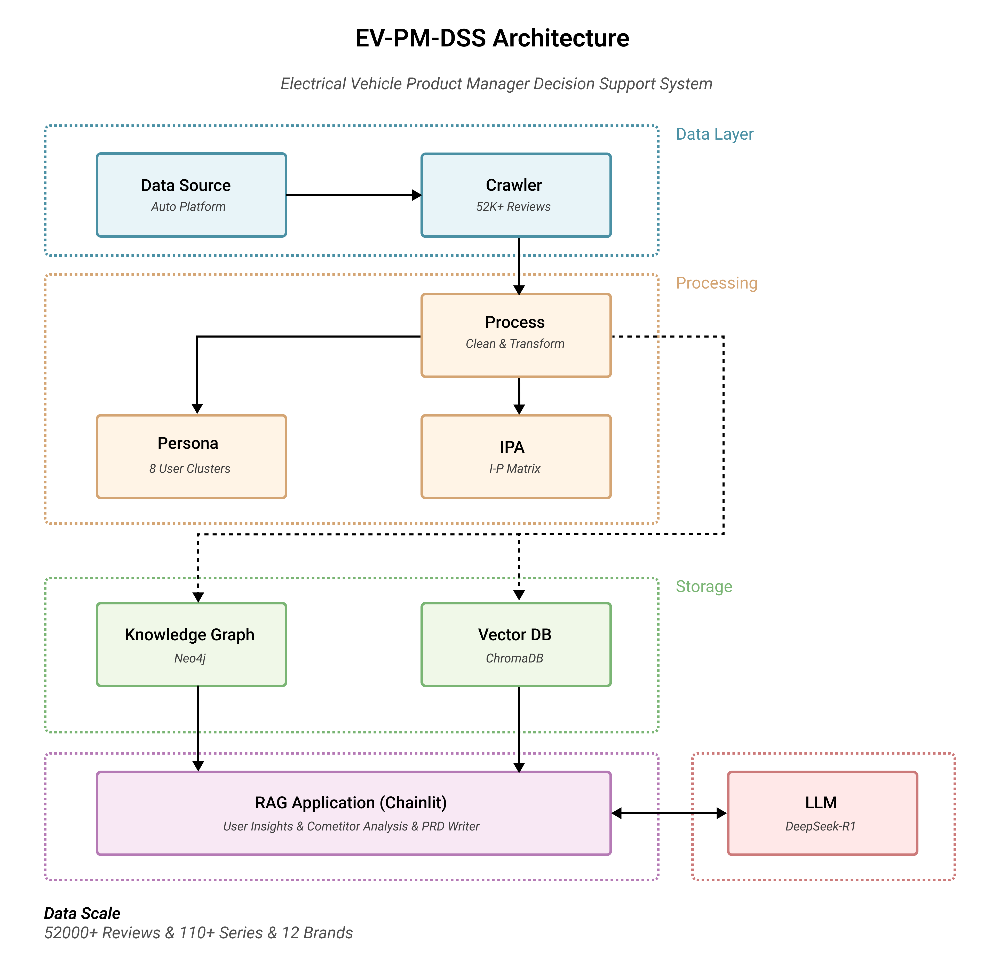
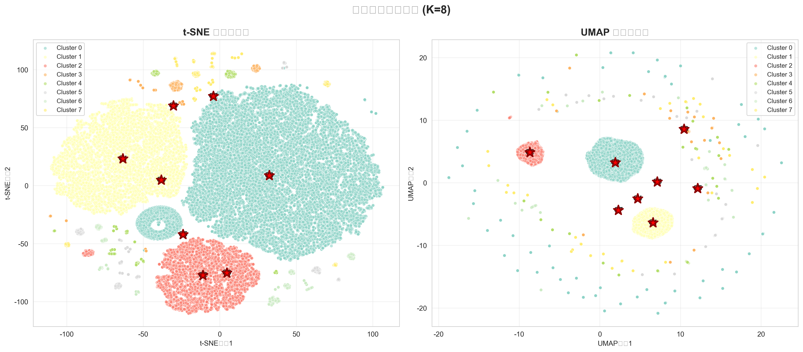
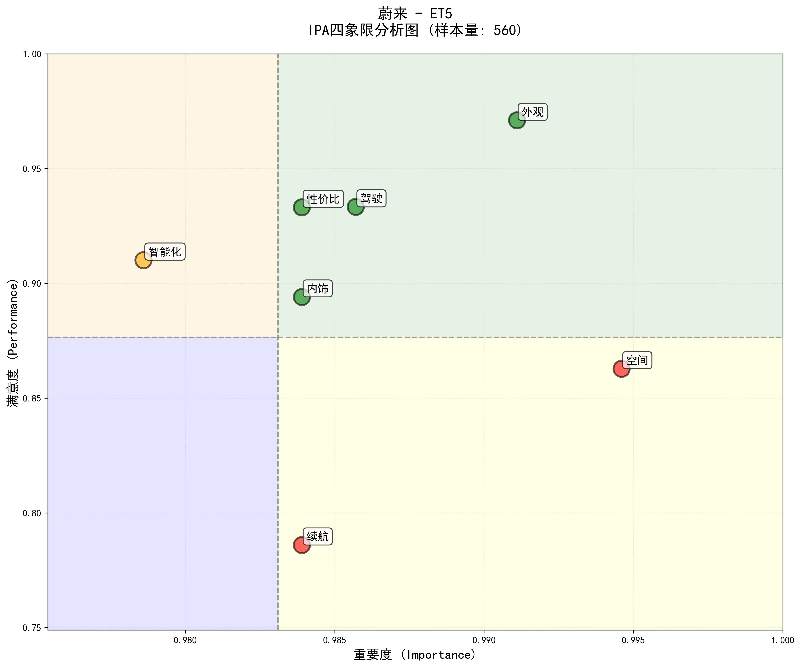
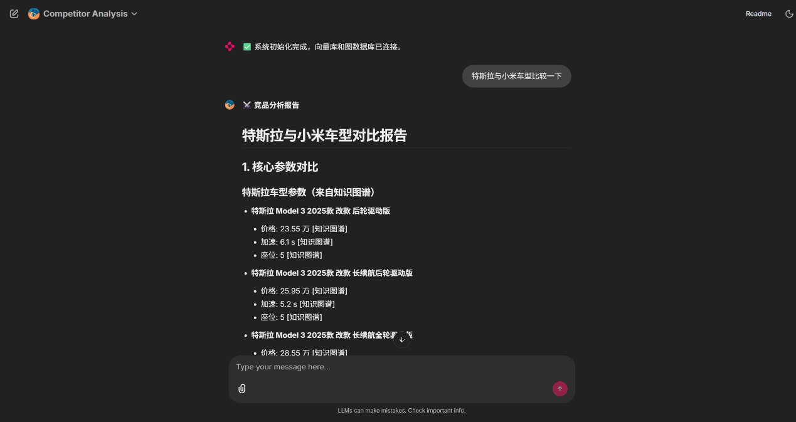

# EV PM DSS - 电动汽车产品管理决策支持系统

Electric Vehicle Product Management Decision Support System

---

## 项目简介

EV PM DSS 是一个端到端的电动汽车产品决策支持系统，结合了数据采集、知识图谱、向量检索和大模型推理，为产品经理提供从用户洞察到 PRD 撰写的全流程智能辅助。

**项目演进：**

本项目基于 [RAG_System](https://github.com/DonkeyKing01/RAG_System) 开发，在初代系统基础上进行了全面升级：
- **数据收集**：扩展数据规模至 52,000+ 条有效评论，覆盖 12 个主流品牌
- **建模方法**：引入用户画像聚类和 IPA 战略分析，增强数据洞察能力
- **应用属性**：强化产品管理场景，支持用户洞察、竞品分析、PRD 撰写全流程

初代项目详情和相关论文请参见：[RAG_System Repository](https://github.com/DonkeyKing01/RAG_System)

**核心数据规模：**

- 数据量级：52,000+ 条深度用户评论
- 覆盖范围：12 个主流品牌（比亚迪、特斯拉、蔚来、理想、小鹏、问界、极氪、小米、BBA等）
- 细分粒度：110+ 车系，22,000+ 车型配置图片
- 用户画像：8 个权威聚类画像
- 知识图谱：Neo4j 图数据库，支持 RAG 检索增强生成

---

## 系统演示

### 系统架构图


### 用户画像聚类结果


### IPA 战略分析矩阵


### RAG 问答系统界面


---

## 系统架构与功能

系统采用模块化设计，主要包含五大核心模块：

```
EV PM DSS/
├── Crawler/    # 数据采集：全量采集参数、图片与UGC评论
├── Process/    # 数据处理：清洗、标准化与结构化处理
├── Analysis/   # 智能分析：用户画像 (Persona) & 战略分析 (IPA)
├── Graph/      # 知识图谱：Neo4j 图数据库构建与查询
├── Vector/     # 向量数据库：ChromaDB 语义检索
└── RAG/        # RAG 应用：基于 Chainlit 的智能问答系统
```

### 1. 数据基础设施 (Crawler + Process)

- **采集 (Crawler):** 针对汽车之家平台，自动化采集车型参数、外观/内饰图片及全量用户口碑。
- **治理 (Process):** 对非结构化数据进行清洗与标准化，输出统一格式的 ugc.csv 黄金数据集，包含 20+ 个核心分析字段（真实续航、成交价、地缘信息等）。

### 2. 用户画像分析 (User Persona Modeling)

基于 K-Means 聚类算法，从评论行为中提取用户注意力向量，结合地理、价格、用车频率等外部属性，精准识别出 8 类典型用户群体：

- 全能均衡型
- 传统务实型
- 品质体验型
- 内饰舒适型
- 极致空间型
- 极致操控型
- 颜值至上型
- 续航焦虑型

### 3. IPA 战略分析 (Importance-Performance Analysis)

构建 "用户关注度-产品表现力" 二维矩阵，针对 7 大核心维度（外观、内饰、空间、智能、操控、续航、性价比）进行战略评估，识别产品的优势区、改进区与机会区。

### 4. 知识增强层 (Graph + Vector)

**知识图谱 (Neo4j)**

- 实体节点：Brand → Series → Model 车型层级，UserPersona 画像节点
- 关系网络：52,000+ Review 节点通过 MENTIONS 关系连接车型
- 属性丰富：完整评分数据（7维）、文本内容（9字段）、IPA 战略定位

**向量数据库 (ChromaDB)**

- 嵌入模型：paraphrase-multilingual-MiniLM-L12-v2
- 三个集合：ugc_reviews（用户评论）、vehicle_specs（车型规格）、user_personas（画像描述）
- 智能检索：分层检索策略（快速15条 → 标准50条 → 深度100条）

### 5. RAG 智能问答系统

**三大核心功能**

- **用户洞察分析 (User Insights):** 基于真实用户评论和权威画像，分析用户需求、痛点和期望
- **竞品分析 (Competitor Analysis):** 对比多品牌车型的关键参数，整合用户口碑和官方规格
- **PRD 文档撰写 (PRD Writer):** 自动生成产品需求文档，所有需求点可溯源到具体数据

**技术亮点**

- 对话记忆：支持多轮对话，自动理解上下文和指代关系
- 混合检索：知识图谱（结构化）+ 向量库（语义检索）
- 数据溯源：每个洞察都标注具体来源，防止幻觉
- 智能路由：自动判断问题类型，选择最优检索策略

---

## 技术栈

**数据科学**

- 语言：Python 3.13
- 数据处理：Pandas, NumPy
- 机器学习：Scikit-learn (K-Means)
- NLP：Transformers (RoBERTa-Chinese), Sentence-Transformers
- 可视化：Matplotlib, Seaborn

**数据库与存储**

- 知识图谱：Neo4j Aura
- 向量数据库：ChromaDB
- 嵌入模型：paraphrase-multilingual-MiniLM-L12-v2

**RAG 应用**

- 前端框架：Chainlit
- 大语言模型：SiliconFlow API (DeepSeek-R1-Distill-Qwen-32B)
- 路由模型：Qwen2.5-7B-Instruct

---

## 快速开始

### 环境配置

```bash
git clone https://github.com/DonkeyKing01/EV-PM-DSS.git
cd EV-PM-DSS
pip install -r requirements.txt
```

### 配置环境变量

复制 `.env.example` 为 `.env`，填入你的凭据：

```bash
# Neo4j 数据库
NEO4J_URI=neo4j+s://your-instance.databases.neo4j.io
NEO4J_USERNAME=neo4j
NEO4J_PASSWORD=your-password

# SiliconFlow API
SILICONFLOW_API_KEY=your-api-key
```

### 运行核心流程

```bash
# 1. 数据采集（可选，已提供处理好的数据）
python Crawler/Parameter_crawler.py
python Crawler/UGC_crawler.py

# 2. 数据处理
python Process/Para_process.py
python Process/UGC_process.py

# 3. 用户画像分析
cd Analysis/Persona
python step1_extract_attention.py
python step3_final_clustering.py
python step4_merge_external_attributes.py

# 4. IPA 战略分析
cd ../IPA
python step1_compute_scores.py
python step2_generate_ipa_reports.py

# 5. 构建知识图谱
python Graph/build_graph.py

# 6. 构建向量数据库
python Vector/build_vector_db.py

# 7. 启动 RAG 应用
chainlit run RAG/app.py
```

访问 http://localhost:8000 开始使用智能问答系统。

---

## 项目结构

```
EV PM DSS/
├── Crawler/              # 数据采集模块
│   ├── Parameter_crawler.py
│   ├── UGC_crawler.py
│   └── Picture_crawler.py
├── Process/              # 数据处理模块
│   ├── Para_process.py
│   ├── UGC_process.py
│   └── Pic_process.py
├── Analysis/             # 分析模块
│   ├── Persona/         # 用户画像聚类
│   └── IPA/             # 重要性-表现分析
├── Graph/                # 知识图谱模块
│   ├── build_graph.py
│   ├── test_graph.py
│   └── clear_graph.py
├── Vector/               # 向量数据库模块
│   ├── build_vector_db.py
│   └── verify_db.py
├── RAG/                  # RAG 应用模块
│   ├── app.py           # Chainlit 主程序
│   ├── tools/           # 检索和分析工具
│   └── chains/          # LangChain 链（预留）
└── Data/                 # 数据存储
    ├── Raw/             # 原始采集数据
    ├── Processed/       # 处理后数据
    ├── Analyzed/        # 分析结果
    └── Vector/          # 向量数据库文件
```

---

## 更新日志

### v1.0.0 (2026-02-16)

- **RAG 应用模块发布**：基于 Chainlit 的智能问答系统上线
- **对话记忆**：支持多轮对话，自动理解上下文
- **混合检索**：知识图谱 + 向量库双引擎检索
- **数据溯源**：所有洞察可展开查看原始数据来源
- **三大功能**：用户洞察、竞品分析、PRD 撰写

### v0.3.0 (2026-02-15)

- **知识图谱模块发布**：构建 Neo4j 知识图谱，整合 52,000+ 评论
- **向量数据库模块**：ChromaDB 语义检索系统
- **属性增强**：Review 节点包含完整文本内容和评分数据

### v0.2.0 (2026-02-14)

- 用户画像模块完工：成功实现基于注意力机制的用户聚类
- IPA 模块启动：完成基础评分矩阵计算逻辑

---

## 贡献与联系

欢迎提交 Issue 或 Pull Request 改进本项目。

- **Author:** [@DonkeyKing01](https://github.com/DonkeyKing01)
- **Repository:** [EV-PM-DSS](https://github.com/DonkeyKing01/EV-PM-DSS)
- **License:** MIT

本项目仅供学习研究使用。
